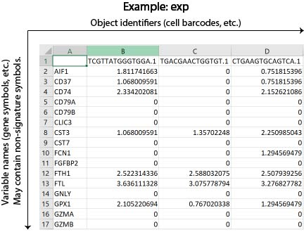
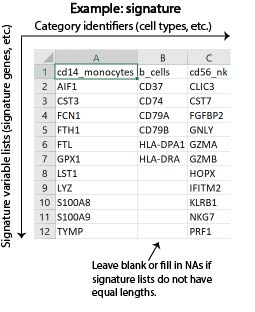
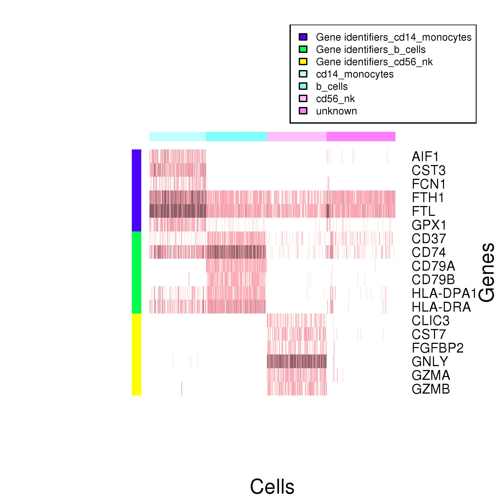

# SCINA
## Introduction
SCINA is an automatic cell type detection and assignment algorithm for single cell RNA-Seq (scRNA-seq) and Cytof/FACS data. SCINA is capable of assigning cell type identities to a pool of cells profiled by scRNA-Seq or Cytof/FACS data with prior knowledge of signatures, such as genes and protein symbols, that are highly-expressed (or lowly-expressed) in each category. 

Please refer to our paper for more details of SCINA:
["SCINA: A Semi-Supervised Subtyping Algorithm of Single Cells and Bulk Samples"](https://www.mdpi.com/2073-4425/10/7/531), Zhang Z, Luo D, et al., 2018

Or please check our web server to run SCINA on the clould: http://lce.biohpc.swmed.edu/scina 

Researchers searching for more bioinformatics tools please visit our lab website: https://qbrc.swmed.edu/labs/wanglab/index.php
## Getting started with SCINA
The SCINA algorithm is implemented in R. Users who are not famaliar with basic R programming are suggested to use our web server to run SCINA with a user-friendly GUI. 
### Installation Instructions
#### Install from CRAN
```{r}
install.packages('SCINA')
library('SCINA')
```
#### Install from GitHub
```{r}
library('devtools')
install_github('jcao89757/SCINA')
library('SCINA')
```
### Dependencies
R (version 2.15.0 or later)

**R Packages**

MASS, gplots, devtools (installation from GitHub only)
## Guided Tutorial
For this tutorial, we will be predicting cell types from a toy example, a single-cell RNA sequencing (scRNA-seq) data matrix freely available from 10X Genomics. The signatures we used as prior knowledge are extracted from the eTME signatures. For more detail please refer to our paper:["An Empirical Approach Leveraging Tumorgrafts to Dissect the Tumor Microenvironment in Renal Cell Carcinoma Identifies Missing Link to Prognostic Inflammatory Factors."](http://cancerdiscovery.aacrjournals.org/content/early/2018/06/08/2159-8290.CD-17-1246). All the data we need for this tutorial is availiable [here](https://github.com/jcao89757/SCINA/tree/master/inst/extdata).
### Prepare input data
The SCINA model takes at least two input data matrices to predict categories.
1. A normalized matrix representing the gene expression levels. Columns correspond to cells, rows correspond to genes or protein symbols. Please find the [.RData example](https://github.com/jcao89757/SCINA/tree/master/inst/extdata/example_expmat.RData) and the [.csv example](https://github.com/jcao89757/SCINA/tree/master/inst/extdata/example_expmat.csv) as examples.
2. A list contains multiple signature vectors. Each vector represents prior knowledge for one cell type, containing genes or protein symbols with high degree of detection. Please find the [.RData example](https://github.com/jcao89757/SCINA/tree/master/inst/extdata/example_signatures.RData) and the [.csv example](https://github.com/jcao89757/SCINA/tree/master/inst/extdata/example_signatures.csv) for the list of signatures.

Both matrices can be uploaded from .Rdata files or .csv files. If the gene expression matrix is uploaded with .csv files, the format requirements are the same as the descriptions above **(Fig.1)**. If the signature identifier list is uploaded with .csv files, each column of the .csv file contains one signature list, and its column name should be the name of the cell type. Each signature vector contains genes or protein symbols. The signature vectors do not need to have the same length **(Fig.2)**. Improper signature lists may cause problems when running SCINA. Please check the **Trouble shooting**
section at the end of this tutorial.



**Fig.1 |** An example of a target dataset in .csv format.



**Fig.2 |** An example of signature lists in .csv format.

After downloading, please load the matrices to your R environment.
```{r}
#.Rdata examples
load(system.file('extdata','example_expmat.RData', package = "SCINA"))
load(system.file('extdata','example_signatures.RData', package = "SCINA"))
exp = exp_test$exp_data

# Or .csv examples
exp=read.csv('your/path/to/example_expmat.csv',row.names=1,stringsAsFactors = F)
signatures=preprocess.signatures('your/path/to/example_signatures.csv')
```
### Standard pre-processing workflow
The example expression matrix we provided here is a normalized example. In most scenarios, users are encouraged to preprocess raw count outputs of their sequencing data. Considering the features of scRNA-seq data, we suggest that users may follow the pre-processing code below to achieve the best performance on their scRNA-seq raw counts. The log-transformation is always suggested to avoid heavy-tailed datasets.
```{r}
#Install preprocessCore if required
source("http://bioconductor.org/biocLite.R")
biocLite("preprocessCore")
library('preprocessCore')
#Read data
exp_raw=read.csv('your/path/to/raw/expression_matrix.csv',row.names=1,stringsAsFactors = F)
#Log scale and quantile normalization
exp_raw=log(exp_raw+1)
exp[]=normalize.quantiles(exp_raw)
```
### Set model parameters
The SCINA algorithm has multiple parameters that users may tune to achieve a better performance. The table below contains description of those parameters.

|Parameters|Details|
|----------|-------|
|max_iter|An integer > 0. Default is 100. Max iterations allowed for SCINA algorithm.|
|convergence_n|An integer > 0. Default is 10. Stop SCINA if during the last n rounds of iterations, cell type assignment keeps steady above the convergence_rate.|
|convergence_rate|A float between 0 and 1. Default is 0.99. Percentage of cells for which the type assignment remains stable for the last n rounds.|
|sensitivity_cutoff|A float between 0 and 1. Default is 1. The cutoff to remove signatures whose cells types are deemed as non-existent at all in the data by SCINA.|
|rm_overlap|A binary value, default 1 (TRUE), denotes that shared symbols between signature lists will be removed. If 0 (FALSE) then allows different cell types to share the same identifiers.|
|allow_unknown|A binary value, default 1 (TRUE). If 0 (FALSE) then no cell will be assigned to the 'unknown' category.|
|log_file|A name string denoting a record for the SCINA running status, path may be included. Default is 'SCINA.log'.|

### Predict cell types with SCINA
SCINA can generate two output matrices in a result list.
```{r}
results = SCINA(exp, signatures, max_iter = 100, convergence_n = 10, 
    convergence_rate = 0.999, sensitivity_cutoff = 0.9, rm_overlap=TRUE, allow_unknown=TRUE, log_file='SCINA.log')
View(results$cell_labels)
View(results$probabilities)
```
More detail of the result is described in the table below.

|Output|Details|
|------|-------|
|cell_labels|A vector contains cell type predictions for each cell.|
|probabilities|A probability matrix indicating the predicted probability for each cell belonging to each cell type, respectively.|
### Result visualization
We provide a function to plot SCINA results in a heatmap. The function takes the expression matrix, the signature lists and the SCINA results as input, and returns a heatmap showing signature genes' expression levels, grouped with SCINA predicted cell types **(Fig.3)**.
```{r}
plotheat.SCINA(exp, results, signatures)
```



**Fig.3 |** An example of the output heatmap.

## Trouble shooting
According to the experience and issues from our users, we found two frequent conditions when SCINA may not work as expected. 
1. If any lists of signature contain small numbers of genes and the parameter 'rm_overlap' is set to 'TRUE' (which is also the default setting), there are chances that those gene signatures become null lists after the overlapped genes are removed. We suggest that each signature list may have at least one unique gene that does not appear in any other signature lists, or users may set 'rm_overlap' to 'FALSE' to avoid such problems.
2. If any lists of signature contain large numbers of genes (about 500 or more), users may fail on running SCINA. That happens because one of the intermediate variables becomes a large enough number to overflow the memory with too many signature genes. We suggest that keep the number of genes in each signature list 10 to 50 to achieve the best performance of SCINA. 
## Version update
1.0.0: First release. (09-20-2018)
1.1.0: Notation update. (09-30-2018)
1.2.0: Bugs fixed. (07-18-2019) 
